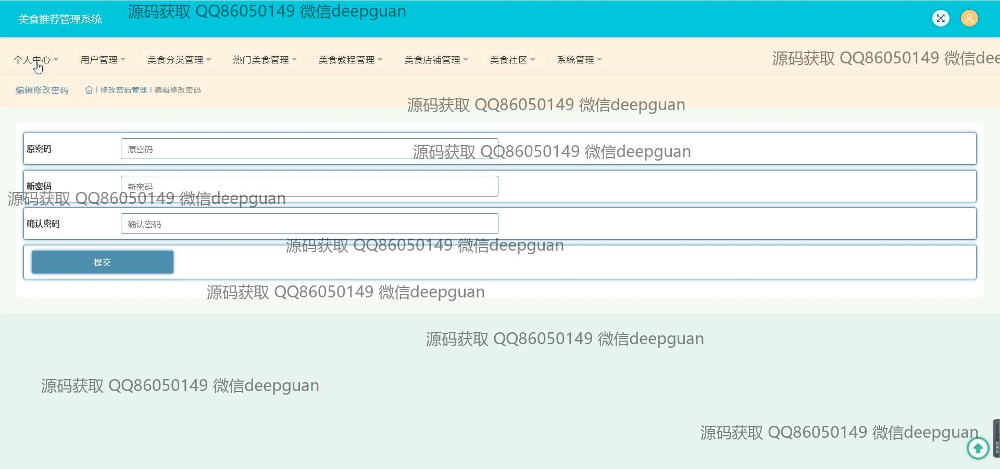
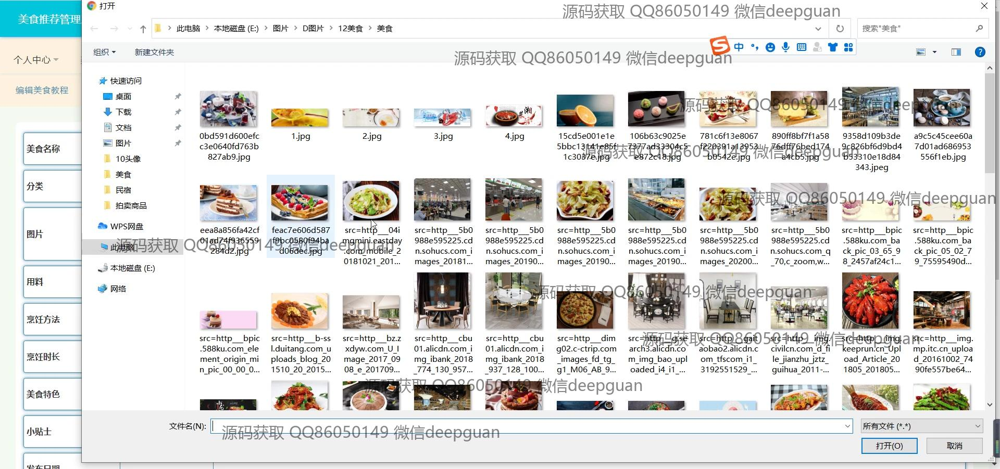
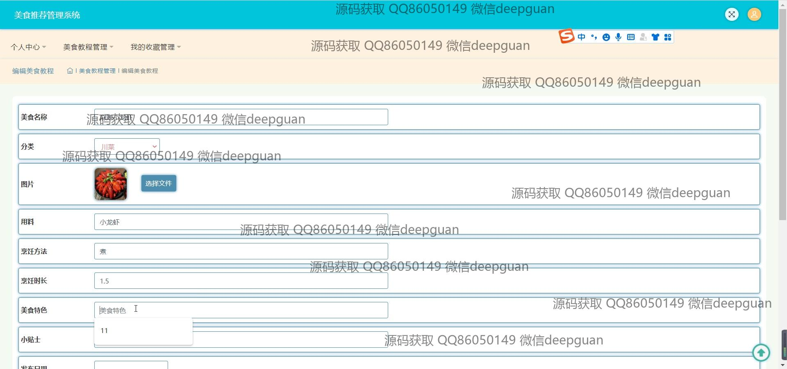
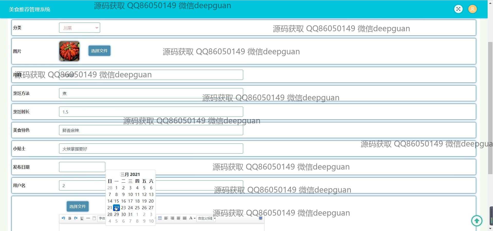

<h1 align="center">的美食推荐管理系统</h1>

## 简介
美食推荐管理系统：主要功能包括美食信息编辑、餐馆管理、用户互动社区、密码修改及多模块导航，旨在提升用户美食体验与互动。    --计算机毕业设计源码；毕设源码；java毕业设计源码

## 联系方式

<h3 align="center">获取完整代码与数据库文件 + 微信：deepguan QQ: 86050149 QQ群: 783742310</h3>

<h3 align="center">可帮忙远程部署 包运行成功！提供远程部署、修改代码、设计文档指导、代码讲解等服务！</h3>

## 功能介绍（完整见运行截图）
管理员：拥有登录、注册和密码修改功能。可访问用户管理、美食分类管理、热门美食管理、美食教程管理和美食店铺管理等模块。支持编辑和管理餐馆信息、上传美食图片、编辑和发布美食信息、管理论坛帖子的功能。可以通过系统管理功能配置和维护系统的各项设置。

用户：可通过登录访问个人中心，查看和修改个人信息，使用美食收藏功能。可以浏览热门美食、查找美食店铺和参与美食社区讨论。能够查看美食的详细信息，包括图片、分类、材料和制作方法，并对其进行评分和评论。用户也可以发布帖子分享美食经验。

美食推荐管理系统：提供美食编辑功能，允许用户输入美食名称、分类、食材和特色描述，上传相关图片。包含菜品的详细信息展示页面，列出选材、烹饪方法和特色。此外，系统支持美食教程模块，帮助用户学习制作美食的步骤和技巧。

美食社区：作为互动模块，用户可发布和评论帖子，与他人交流美食经验。包含搜索功能，便于查找特定内容。社区页面展示不同用户发布的美食主题讨论，支持浏览和参与形式的互动。在论坛中心，用户可撰写和分享详细帖子，包括插图和格式编辑。

## 运行截图

本代码来源于网络,仅供学习参考使用!

